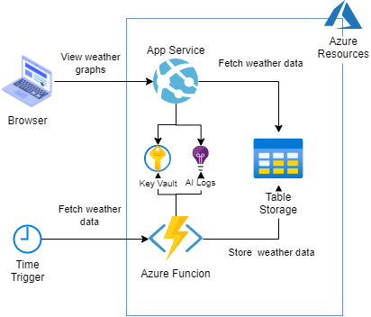
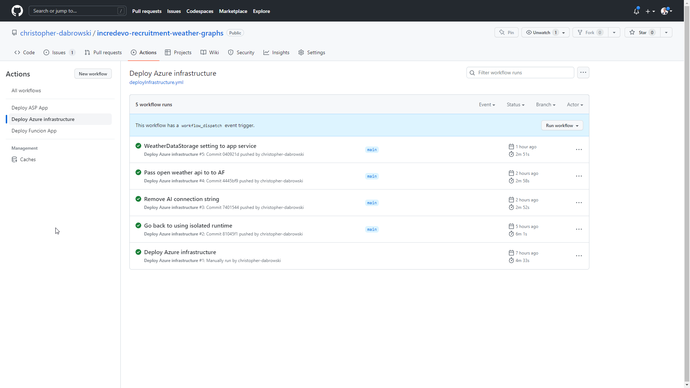
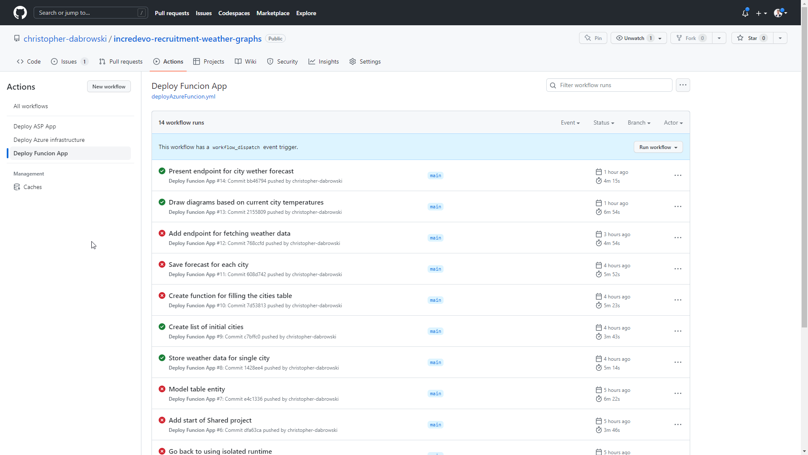

# IncreDevo recruitment task - Log API calls

This is my attempt at solving the second recruitment task for the [IncreDevo company](https://incredevo.com/)

## Task description

Must use:

- ASP.NET CORE MVC (6)
- C#
- JavaScript

Achieve:

Using any public weather API receive data (country, city, temperature, clouds, wind speed) from at least 10 cities in 5 countries  
with periodical update 1/min,
store this data in the database  
and show the 2 graphs:  

- min temperature (Country\City\Temperature\Last update time)
- highest wind speed (Country\City\Wind Speed\Last update time)
- temperature & wind speed trend for last 2 hours on click for both previous graphs

## Solution

Description of my solution to the presented problem.

### Architecture

#### IoC

<!-- I've used [Bicep](https://learn.microsoft.com/en-us/azure/azure-resource-manager/bicep/overview) to define IoC. The IoC approach allows me to have documented and consistent infrastructure.
I've chosen Bicep technology as it's easy to run from any environment that has access to Azure.

The Bicep code can be found in the [infrastructure](infrastructure) directory.

The Bicep resource and module dependencies diagram looks as follows:

 -->

_WIP_

### Time tracking

For time tracking I'm using [Clockify](https://clockify.me/) and I'm tracking time for each task using GitHub issues.  
I'll add the final time report when I finish the task.

### CI/CD

<!-- To implement an automated deployment process I've used GitHub Actions.  
Specific actions are triggered when changes are pushed to a specific repository path or can be triggered manually.  
Actions definitions can be found in the [.github/workflows](.github/workflows) directory. -->

_WIP_

### Solution showcase

_WIP_

<!-- #### GitHub Action runs

The runs can be viewed in the [Actions repo tab](https://github.com/christopher-dabrowski/incredevo-recruitment-log-api-calls/actions)

 -->

### Notes

Noteworthy decisions and aspects of the implementation and project configuration or work methodology.

- I've decided to use Azure Table Storage for the database, as I don't need to model relations between entities and Table Storage is significantly cheaper than a SQL database
